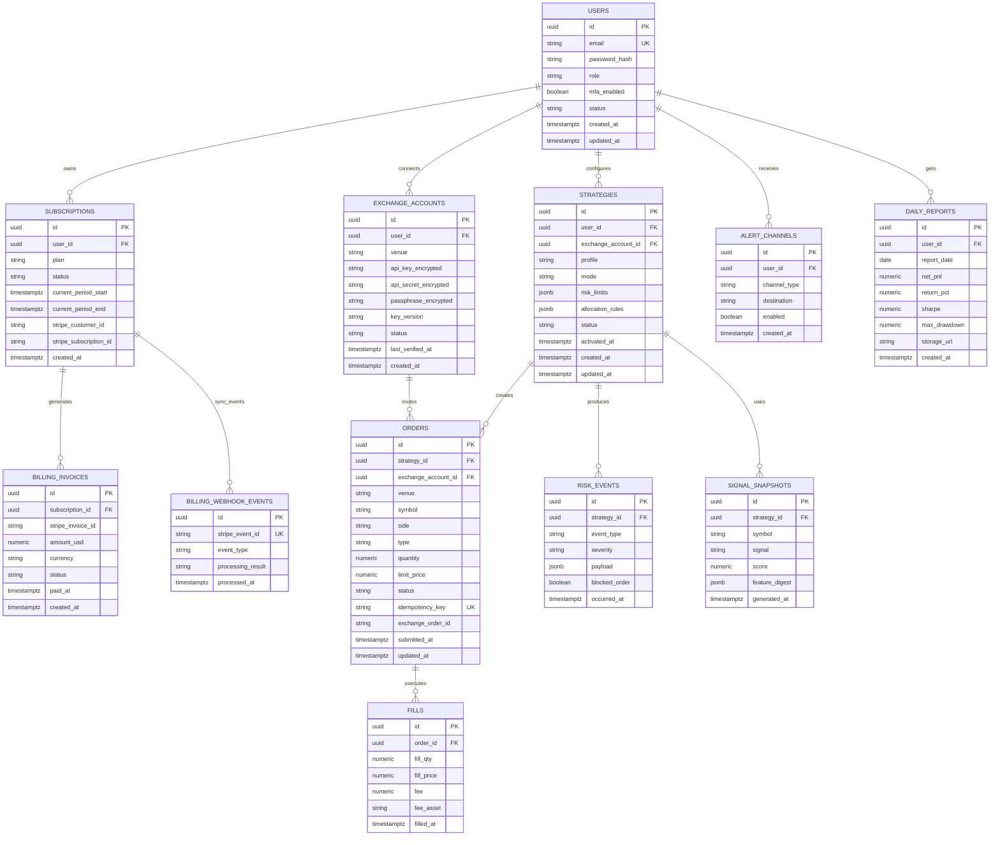

# ERD (MVP)

## 개요
아래 ERD는 구독형 AI 투자 자동화 시스템의 MVP 기준 데이터 모델이다. 핵심은 `user -> subscription -> exchange_account -> strategy -> order/fill` 흐름과 리스크 이벤트 추적이다.

## 설계 메모
1. `strategies.risk_limits`는 일손실/포지션/변동성 제한을 JSON으로 저장해 초기 유연성을 확보한다.
2. `orders.idempotency_key`를 unique로 강제해 중복 주문을 차단한다.
3. 민감 정보(API 키)는 암호화된 문자열만 저장하고 평문은 저장하지 않는다.
