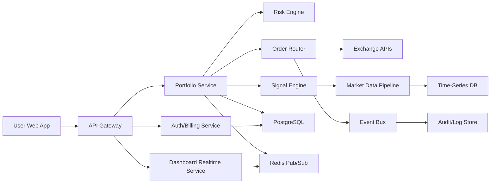
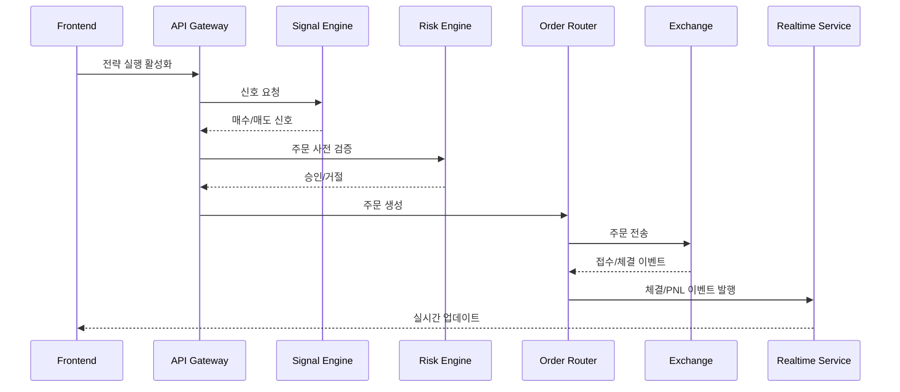

# 기술 아키텍처 명세서

## 1. 문서 정보
- 프로젝트명: AI 투자 자동화 시스템
- 문서 버전: v1.0 (MVP)
- 작성일: 2026-02-13

## 2. 아키텍처 목표
1. 안정적인 자동주문 실행
2. 실시간 데이터 시각화
3. 보안 중심의 API 키/결제 처리
4. 전략 성능 검증 및 롤백 가능한 배포 체계

## 3. 상위 구조

## 4. 서비스 구성
### 4.1 Frontend (Next.js)
1. 로그인/구독 관리 UI
2. 실시간 투자 대시보드
3. 전략/리스크 설정 화면
4. 알림 센터

### 4.2 API Gateway
1. 인증 토큰 검증
2. 요청 라우팅/레이트 리밋
3. 공통 에러 포맷/감사 트레이스 ID 부여

### 4.3 Auth/Billing Service
1. 사용자/권한 관리
2. Stripe 구독 상태 동기화 (Webhook)
3. 플랜별 기능 게이팅

### 4.4 Signal Engine
1. 피처 생성: 가격, 거래량, 변동성, 온체인, 감성 지표
2. 추론: 전략 점수 산출
3. 신호 품질 체크: 드리프트 감지, 신뢰도 점수

### 4.5 Risk Engine
1. 사전 주문 검증: 노출 한도, 일손실, 변동성 제한
2. 사후 모니터링: 누적 손실, MDD 초과, 이상 탐지
3. Kill Switch: 자동 진입 차단 및 포지션 정리 정책

### 4.6 Order Router
1. 거래소별 주문 어댑터
2. 체결 상태 추적, 재시도/취소 로직
3. 멱등키 기반 중복 주문 방지

### 4.7 Dashboard Realtime Service
1. WebSocket 스트리밍
2. 포트폴리오/주문/알림 실시간 업데이트
3. 사용자별 채널 분리

## 5. 데이터 아키텍처
### 5.1 저장소
1. PostgreSQL
- 사용자, 구독, 전략 설정, 주문 메타데이터, 감사 테이블

2. Time-Series DB (TimescaleDB 또는 InfluxDB)
- 가격/지표/PNL 시계열

3. Redis
- 세션 캐시, 레이트리밋 카운터, 실시간 이벤트 버퍼

4. Object Storage
- 리포트, 백테스트 산출물, 모델 아티팩트

### 5.2 핵심 테이블 (예시)
1. `users(id, email, status, mfa_enabled, created_at)`
2. `subscriptions(user_id, plan, status, renew_at)`
3. `exchange_accounts(id, user_id, venue, enc_api_key, key_version)`
4. `strategies(id, user_id, profile, risk_limit_json, status)`
5. `orders(id, strategy_id, venue, symbol, side, qty, price, status, idempotency_key)`
6. `fills(id, order_id, fill_qty, fill_price, fee, ts)`
7. `risk_events(id, strategy_id, event_type, severity, payload, ts)`

## 6. 핵심 시퀀스
### 6.1 주문 실행 흐름

## 7. API 설계 원칙
1. REST + WebSocket 혼합
2. 모든 변경 요청에 `x-idempotency-key` 지원
3. 에러 코드 표준화 (`AUTH_*`, `RISK_*`, `ORDER_*`, `BILLING_*`)

### 7.1 대표 엔드포인트
1. `POST /v1/auth/login`
2. `POST /v1/billing/checkout-session`
3. `POST /v1/exchanges/accounts`
4. `POST /v1/strategies/{id}/activate`
5. `POST /v1/orders/simulate`
6. `GET /v1/portfolio/summary`
7. `GET /v1/reports/daily`
8. `WS /v1/stream`

## 8. 보안 설계
1. API 키는 평문 저장 금지, KMS envelope encryption 적용
2. 서비스 간 mTLS 또는 private network 통신
3. JWT + 회전형 Refresh Token
4. IP/디바이스 이상 징후 탐지
5. 감사로그 불변 저장(append-only)

## 9. 신뢰성/운영
1. SLO
- 주문 성공률 99.5%+
- 실시간 이벤트 전달 성공률 99.9%+

2. 장애 대응
- 거래소 API 장애 시 circuit breaker
- 주문 큐 적체 시 자동 소비자 증설
- 핵심 서비스 헬스체크 + 자동 재시작

3. 관측성
- Metrics: Prometheus
- Logs: 구조화 JSON + 중앙 수집
- Tracing: OpenTelemetry
- Alerting: PagerDuty/Slack

## 10. 배포 전략
1. 환경 분리: `dev`, `staging`, `prod`
2. 배포 방식: 블루그린 또는 카나리
3. IaC: Terraform
4. CI/CD: GitHub Actions
5. 마이그레이션: backward-compatible 우선, 롤백 스크립트 필수

## 11. 성능 목표
1. 대시보드 API p95 < 300ms
2. 주문 요청~접수 p95 < 800ms
3. WebSocket 이벤트 지연 p95 < 3s

## 12. 리스크 및 대응
1. 모델 과최적화
- 워크포워드 검증, 비용 포함 백테스트, 실거래 소액 단계적 확대

2. 체결 슬리피지 확대
- 유동성 필터, 주문 분할, 고변동 구간 노출 감축

3. 규제 변화
- 국가별 접근 통제 플래그, 약관/고지 즉시 업데이트 프로세스

## 13. 오픈 이슈
1. MVP 지원 거래소 우선순위 확정
2. 전략 프로파일(보수/중립/공격)별 기본 리스크 파라미터 확정
3. 실시간 데이터 공급자 단일/다중 벤더 전략 확정

